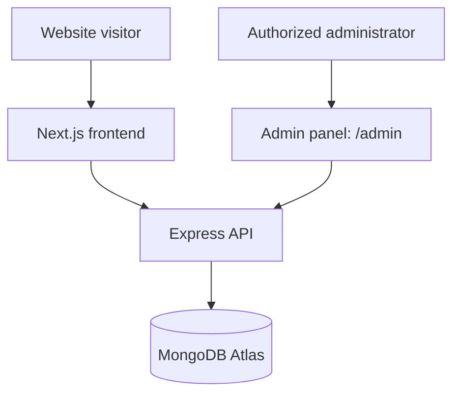
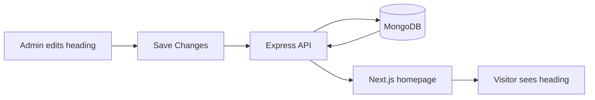
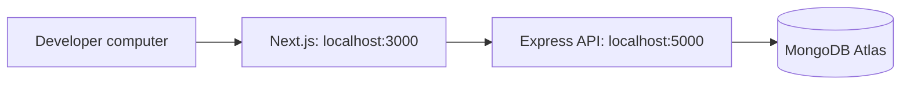
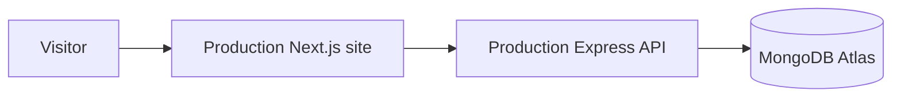

# Digital Agency Website — Project Architecture & Data Flow

## 1. Project overview

This Digital Agency website has three connected parts:

| Part | Plain-English purpose |
| --- | --- |
| **Frontend** | The website that visitors and administrators see and use. |
| **Backend / API** | The secure middle layer that receives requests, checks permissions, validates changes, and communicates with the database. |
| **Database** | The secure storage location for editable website information. |

There is also an **admin panel**. Authorized administrators can sign in and manage homepage content without editing website source code.

## 2. Technology stack

| Area | Technology in this project | What it does |
| --- | --- | --- |
| Public website and admin panel | Next.js, React, Tailwind CSS | Builds the website pages and the browser interface. |
| Backend API | Node.js, Express.js | Handles requests, security checks, and data updates. |
| Database | MongoDB Atlas, Mongoose | Stores application data and provides a structured way to access it. |
| Admin authentication | JWT, HTTP-only cookies, bcryptjs | Signs administrators in securely and protects admin-only actions. |
| Validation and protection | Helmet, CORS, rate limiting, express-validator | Helps protect the API and reject unsuitable requests. |
| Images today | Image URLs and local website images | The CMS saves image addresses; it does not upload image files to MongoDB. |

There is no production hosting configuration in this repository. MongoDB Atlas is the configured database service; frontend and backend production hosting remain planned.

## 3. Simple architecture



Visitors and administrators do **not** connect directly to MongoDB. The Express API is the secure gatekeeper between the website and the database.

## 4. How the public website works

1. A visitor opens the website.
2. Next.js prepares and displays the website interface.
3. For homepage CMS content, Next.js requests `GET /api/homepage` from the Express API.
4. Express requests the homepage document from MongoDB Atlas.
5. MongoDB returns the saved content to Express.
6. Express returns safe JSON data to Next.js.
7. Next.js displays that content using the existing visual design.

The homepage includes a safe built-in display fallback. This keeps the current page visually available if homepage CMS content has not yet been initialized or the API is temporarily unavailable.

### Homepage heading example

The current default heading is **“Bigger, Bolder and Better.”** Once an administrator saves homepage content:



## 5. How the admin panel works

1. The administrator opens `/admin/login`.
2. They enter their email address and password.
3. The Express API checks the credentials securely.
4. When valid, the API creates a short-lived, HTTP-only authentication cookie. This cookie is not readable by page JavaScript.
5. The administrator can then access `/admin`.
6. The editor loads the homepage content or safe starter values for first-time setup.
7. When **Save Changes** is selected, the API checks the administrator’s identity, validates the submitted content, and saves the homepage document.

```mermaid
flowchart TD
  Admin[Admin] --> Login[/admin/login]
  Login --> Auth[Express authentication]
  Auth --> Dashboard[/admin]
  Dashboard --> Save[Save Changes]
  Save --> Check[Authentication and validation]
  Check --> Mongo[(MongoDB Atlas)]
  Mongo --> Success[Success message in editor]
```

## 6. Homepage content flow

The current homepage CMS manages one homepage document with these sections:

| Section | Editable content |
| --- | --- |
| Banner | Heading, description, and statistics. |
| Banner information | Top-list items, founder name/title/image URL, supporting heading, and services. |
| Work | Image URL, title, project URL, and display order. |

The Work list may be empty. A Work item needs an image URL when it contains content; title and project URL are optional. Empty unused editor rows are safely ignored.

## 7. Example: editing the homepage

Suppose the client changes the heading from **“Bigger, Bolder and Better”** to **“Build Bigger. Grow Better.”**

1. The client signs in to the admin panel.
2. They update the heading and select **Save Changes**.
3. The admin panel sends the new content to the Express API.
4. The API confirms the user is authorized and checks that the data is suitable.
5. MongoDB saves the updated homepage document.
6. The next homepage request receives the new heading.
7. Visitors see the update with the same existing page design.

Normal homepage content changes do not require a developer to edit the frontend code.

## 8. Data flow examples

### Administrator saving content

```text
ADMIN
  ↓
Admin Panel
  ↓
API request
  ↓
Express Backend
  ↓
Authentication and validation
  ↓
MongoDB Atlas
  ↓
Success response
  ↓
Admin Panel
```

### Visitor viewing content

```text
VISITOR
  ↓
Next.js Website
  ↓
API request
  ↓
Express Backend
  ↓
MongoDB Atlas
  ↓
Response
  ↓
Next.js
  ↓
Visitor sees content
```

## 9. Why the backend is used

The database is not exposed directly to website visitors. The backend acts as a secure gatekeeper between the website and the database.

It provides:

- **Security:** visitors cannot connect directly to the database.
- **Authentication:** only signed-in administrators can update admin content.
- **Validation:** unsuitable or incomplete changes can be rejected before saving.
- **Access control:** admin-only API routes require a valid login.
- **Central management:** the same data can later be used by more website pages or admin tools.

## 10. Current security approach

The current implementation includes:

- Password hashing with bcryptjs; plain-text passwords are not stored.
- JWT-based admin authentication in HTTP-only cookies.
- Protected homepage-admin routes.
- Login rate limiting and broader API rate limiting.
- Request validation for login and homepage data.
- CORS configured for the frontend origin.
- Helmet security headers.
- Environment variables for database and authentication secrets.
- No database credentials or JWT secret in frontend code.

## 11. Image and media flow

At present, the CMS stores **image URLs**, not image files. Local website images can be referenced with paths such as `/images/...`, and externally hosted image URLs can also be used where supported.

Images are not stored as large files inside MongoDB. A future media library, such as Cloudinary-backed upload support, can let administrators upload and manage images directly. It is not active in the current project.

## 12. Deployment architecture

### Current development setup



### Planned production setup



No Vercel configuration or deployed backend configuration is present in the repository. Production hosting should therefore be treated as planned, not already deployed. Environment variables allow the development and production addresses to differ safely.

## 13. Development versus production

| Environment | Current connection pattern |
| --- | --- |
| Development | Next.js runs locally on port `3000`, Express runs locally on port `5000`, and Express connects to MongoDB Atlas. |
| Production | A production Next.js site would communicate with a separately hosted production Express API, which would communicate with MongoDB Atlas. |

Environment variables hold addresses and sensitive settings so they are not embedded in source code and can differ between environments.

## 14. What happens when data is saved

For example, an administrator changes **Projects Completed** from `125+` to `150+`:

1. The administrator selects **Save Changes**.
2. The browser sends the homepage data to the protected API.
3. Express confirms the administrator is signed in.
4. Express validates the data.
5. MongoDB updates the single homepage document.
6. Express returns a success response.
7. The editor shows a success message.

## 15. What happens when a visitor opens the website

1. The visitor opens the website.
2. Next.js loads the existing website layout.
3. Next.js requests saved homepage CMS content when available.
4. Express requests the content from MongoDB Atlas.
5. MongoDB returns the document.
6. Express returns JSON to Next.js.
7. Next.js renders the content in the existing homepage design.

## 16. Current project status

### Completed

- [x] Next.js and React frontend.
- [x] Tailwind CSS styling.
- [x] Separate Express backend foundation.
- [x] MongoDB Atlas connection support.
- [x] Admin model, secure password hashing, login/logout/current-admin routes.
- [x] Protected admin API routes.
- [x] Homepage CMS model and homepage API routes.
- [x] Homepage editor at `/admin` and login page at `/admin/login`.
- [x] Public homepage integration with saved homepage content and a design-preserving fallback.

### In progress / requires content setup

- [ ] First homepage document must be saved through the administrator editor before `GET /api/homepage` returns stored CMS content.
- [ ] Production frontend and backend hosting configuration.

### Planned

- [ ] Image upload/media library.
- [ ] Services management.
- [ ] Projects management.
- [ ] Testimonials management.
- [ ] Team management.
- [ ] Blog management.
- [ ] Contact form and enquiry management.
- [ ] Website settings and expanded SEO management.

## 17. Future CMS expansion

The current structure can be expanded with client-friendly tools for:

- Services and project portfolios.
- Testimonials and team members.
- Blog articles.
- Contact enquiries.
- Website-wide settings, social links, and SEO information.
- A media library for image uploads.

These are future modules; they are not currently part of the working CMS.

## 18. Client-friendly summary

The website has three main layers: the frontend that visitors see, the backend that securely manages requests, and MongoDB Atlas where editable data is stored. Authorized administrators can manage homepage content in the admin panel without changing the website’s source code. The existing public visual design remains separate from the content-management system.

## 19. Simple FAQ

### Where is the website content stored?

Saved homepage CMS content is stored in MongoDB Atlas. The public website also has a safe built-in fallback until that homepage document is first saved.

### Can we change homepage content without a developer?

Yes. An authorized administrator can use `/admin` to change the currently supported homepage content and save it.

### Can multiple administrators be added later?

The database model supports administrator accounts and roles. A complete administrator-management screen has not yet been built, so adding further accounts currently requires a future admin-management feature or developer assistance.

### Are website visitors able to access the database directly?

No. Visitors communicate with the frontend and API only. The API controls access to MongoDB.

### Where are images stored?

Currently, the CMS stores image URLs. Local website images remain in the frontend project. A dedicated upload/media service is planned for the future.

### What happens if the database is unavailable?

The API reports its connection status through its health endpoint. The public homepage has a built-in content fallback, while administrator changes cannot be saved until the database connection is restored.

### Can we add more sections later?

Yes. The backend and admin panel can be extended with additional CMS modules while keeping the public design separate.

### Can this system support a blog?

Yes. A blog is a planned future CMS module; it is not implemented yet.
